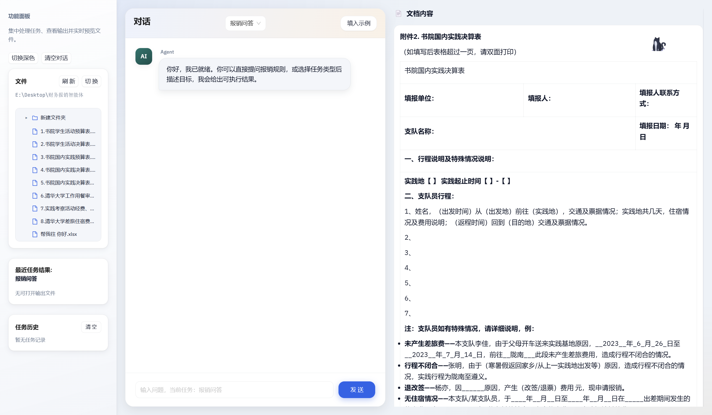
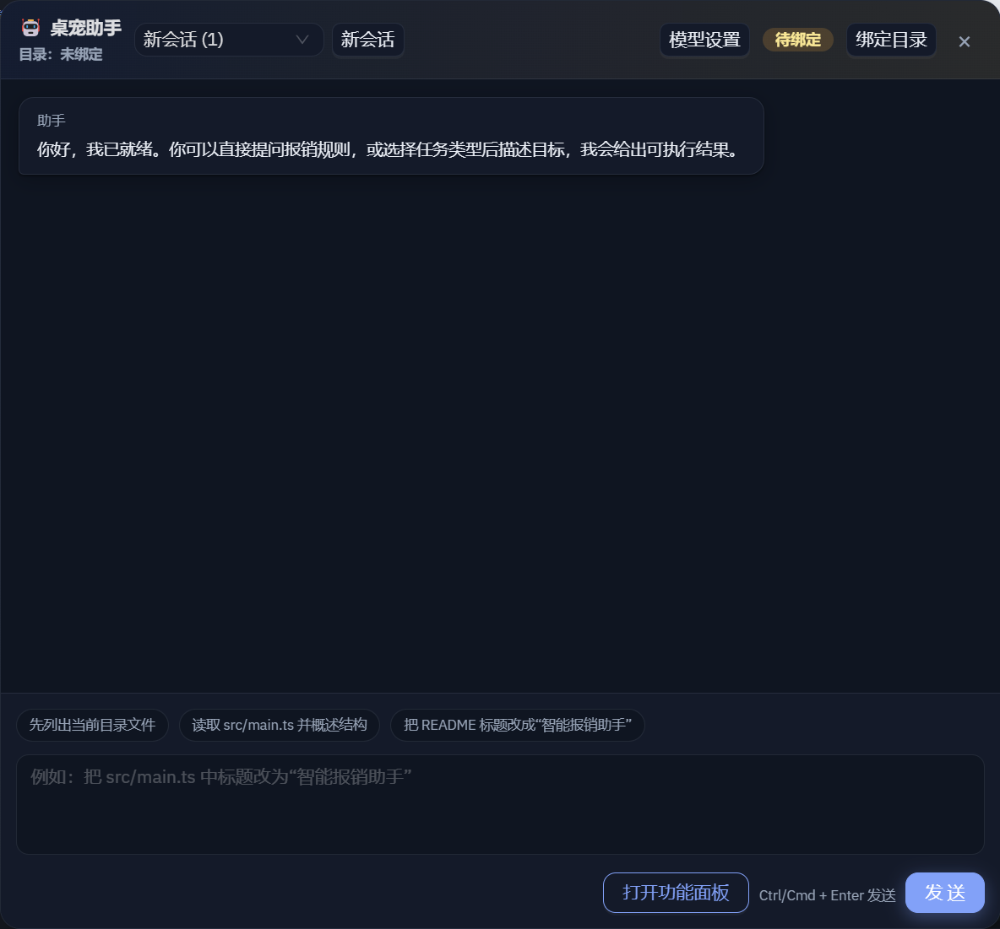

<div align="center">

# 财务报销 Agent

一个面向本地桌面场景的智能报销辅助系统，集成 `LangGraph` 工作流、文档解析、规则问答、知识库检索、模板预览和安全沙箱能力。

[English](./README.en.md) | 简体中文


</div>

## 快速链接

- [贡献指南](./CONTRIBUTING.md)
- [变更记录](./CHANGELOG.md)
- [英文文档](./README.en.md)

## 目录

- [项目亮点](#项目亮点)
- [截图预览](#截图预览)
- [适用场景](#适用场景)
- [技术架构](#技术架构)
- [快速开始](#快速开始)
- [配置说明](#配置说明)
- [项目结构](#项目结构)
- [FAQ](#faq)
- [测试](#测试)
- [贡献指南](#贡献指南)
- [路线图](#路线图)
- [许可证](#许可证)

## 项目亮点

- `桌面端交互`：基于 `Electron + React + Vite`，包含桌面主面板、模板预览和桥接层。
- `流程化 Agent`：基于 `Python + LangGraph` 编排问答、报销、预算、决算等任务流。
- `本地优先`：知识库、数据库、导出结果和审计日志都落在本地目录，便于追踪与维护。
- `多格式解析`：支持 `Word / Excel / PDF / 图片 / Markdown / HTML / PPT` 等文档输入。
- `模型可选接入`：既可仅使用本地规则，也可接入兼容 OpenAI 的模型服务。
- `安全沙箱`：支持代码扫描、隔离执行与审计留痕。

## 截图预览

| 模块 | 说明 | 建议文件名 |
| --- | --- | --- |
| 主面板 | 展示桌面端首页、功能入口、任务状态 | `docs/images/dashboard.png` |
| 模板预览 | 展示 `docx/xlsx` 的实时预览界面 | `docs/images/preview.png` |
| 桌宠交互 | 展示桌宠悬浮窗、气泡消息或拖拽入口 | `docs/images/pet.png` |
| 问答或审计结果 | 展示规则问答、审计报告或生成结果 | `docs/images/qa-or-report.png` |

```md


```

## 适用场景

- `报销规则问答`：回答报销制度、材料要求和流程问题。
- `单次报销处理`：扫描材料、提取结构化信息、执行规则校验并生成结果。
- `年度决算与预算`：聚合历史记录，输出预算表、决算表和分析内容。
- `模板文件预览`：对 `xlsx/xls/docx` 模板进行本地预览和自动刷新。
- `安全代码执行`：在受限环境中完成扫描、执行与审计。

## 技术架构

### 技术栈

**后端**

- `Python`
- `LangGraph`
- `pandas`
- `jsonschema`
- `openpyxl`
- `python-docx`
- `python-pptx`
- `PyMuPDF`

**桌面端**

- `Electron`
- `React`
- `TypeScript`
- `Vite`
- `Ant Design`

### 核心流程

```text
输入数据
  -> Data_Extraction
  -> Category_Alignment
  -> Consistency_Check
  -> Compliance_Audit
  -> Report_Generator
  -> JSON / Markdown 报告
```

### 模块分层

```text
desktop_app/          Electron 桌面端与预览界面
agent/                Agent 核心能力、图编排、工具与子模块
data/                 本地数据库、知识库、审计日志、模板数据
docs/                 示例文档、设计资料和输出样例
tests/                自动化测试
```

## 快速开始

### 1. 克隆项目

```bash
git clone <your-repo-url>
cd agent
```

### 2. 安装后端依赖

建议使用 `Python 3.10+`。

```bash
python -m venv .venv
.venv\Scripts\activate
pip install -r requirements.txt
```

### 3. 启动桌面端

建议使用 `Node.js 18+`。

```bash
cd desktop_app
npm install
npm run dev
```

### 4. 运行后端示例

```bash
python run_v2.py
```

也可以运行最小示例流程：

```bash
python agent.py
```

## 配置说明

### LLM 自由问答

默认情况下，系统可使用本地规则回复；如果配置了模型环境变量，则普通对话可切换为自由问答模式。

```bash
# PowerShell 示例
$env:AGENT_LLM_API_KEY="你的Key"
$env:AGENT_LLM_MODEL="gpt-4o-mini"
$env:AGENT_LLM_BASE_URL="https://api.openai.com/v1"
$env:AGENT_LLM_TIMEOUT="60"
```

说明：

- 未设置 `AGENT_LLM_API_KEY` 时，系统不会调用云端模型。
- `AGENT_LLM_BASE_URL` 与 `AGENT_LLM_API_URL` 均可使用，代码优先读取 `BASE_URL`。
- 若地址未带 `/v1`，系统会自动补齐再调用接口。

### 接入 Paratera

```bash
$env:AGENT_LLM_API_KEY="<你的真实Key>"
$env:AGENT_LLM_API_URL="https://llmapi.paratera.com"
$env:AGENT_LLM_MODEL="<平台可用模型ID>"
```

### 接入 LM Studio

```bash
$env:AGENT_LLM_BASE_URL="http://127.0.0.1:1234/v1"
$env:AGENT_LLM_MODEL="google/gemma-3-4b"
```

也可以写入 `desktop_app/.env`：

```bash
AGENT_LLM_BASE_URL=http://127.0.0.1:1234/v1
AGENT_LLM_MODEL=google/gemma-3-4b
```

### 知识库配置

如果你已经将报销制度文档放入 `docs/reimbursement`，可先构建本地知识库：

```bash
python -m agent.kb.ingest --source docs/reimbursement --output data/kb/reimbursement_kb.json
```

然后在 `desktop_app/.env` 中配置：

```bash
AGENT_KB_PATH=../data/kb/reimbursement_kb.json
AGENT_KB_TOP_K=4
AGENT_KB_MAX_CHARS=1800
```

### 图策略参数

可在任务 `payload` 中通过 `graph_policy` 控制各 SubGraph 的行为：

```json
{
  "graph_policy": {
    "reimburse_stop_on_rule_violation": true,
    "qa_allow_empty_query": false,
    "qa_kb_top_k": 4,
    "qa_kb_score_threshold": 0.75,
    "final_generate_when_empty": true,
    "budget_skip_calculate_when_empty": true
  }
}
```

可选环境变量：

- `AGENT_GRAPH_REIMBURSE_STOP_ON_RULE_VIOLATION`
- `AGENT_GRAPH_QA_ALLOW_EMPTY_QUERY`
- `AGENT_GRAPH_QA_KB_TOP_K`
- `AGENT_GRAPH_QA_KB_SCORE_THRESHOLD`
- `AGENT_GRAPH_FINAL_GENERATE_WHEN_EMPTY`
- `AGENT_GRAPH_BUDGET_SKIP_CALCULATE_WHEN_EMPTY`

### 审计阈值配置

```bash
AGENT_CATEGORY_OVERRUN_THRESHOLD=0.10
AGENT_HIGH_RISK_LABEL=High Risk
AGENT_SPECIAL_EXPENSE_KEYWORDS=餐饮,会议
```

## 项目结构

```text
agent/
├── core/             调度、事件总线、窗口管理
├── graphs/           主图与各类 SubGraph
├── kb/               本地知识库构建与检索
├── parser/           多格式文档解析能力
├── sandbox/          代码沙箱与安全策略
└── tools/            面向工作流的工具封装

desktop_app/
├── electron/         Electron 主进程与 preload
├── src/              React 页面与组件
└── agent_bridge/     桌面端与 Python Agent 桥接层

data/
├── audit/            审计日志
├── db/               本地数据库
├── kb/               本地知识库文件
└── templates/        示例模板与输出依赖
```

## FAQ

### 1. 不配置 LLM 也能运行吗？

可以。未设置 `AGENT_LLM_API_KEY` 时，系统仍可使用本地规则问答和既有流程能力，不会调用云端模型。

### 2. 可以接本地模型吗？

可以。项目支持兼容 OpenAI 协议的本地服务，例如 `LM Studio`。

### 3. 知识库文档更新后需要做什么？

重新执行一次 `python -m agent.kb.ingest ...` 构建命令即可刷新本地知识库。

### 4. 为什么 README 里没有产品截图？

当前仓库里还没有正式截图资源。建议将截图放入 `docs/images/` 后，在“截图预览”部分替换占位内容。

### 5. 当前是否已有开源许可证？

仓库目前未看到明确的 `LICENSE` 文件。如果准备公开发布，建议补充许可证文件和说明。

## 测试

项目当前测试以 `unittest` 为主，可在根目录执行：

```bash
python -m unittest discover -s tests
```

## RAG 评估（TruLens）

已接入 `TruLens` 离线评估入口，用于评估当前检索链路（`search_policy`）在真实知识库上的表现。

### 1. 安装依赖

```bash
pip install -r requirements.txt
```

### 2. 直接基于知识库自动生成评估问题并运行

```bash
python run_trulens_eval.py --kb-path data/kb/reimbursement_kb.json --top-k 4 --max-samples 30
```

### 3. 指定自定义评估集

```bash
python run_trulens_eval.py --kb-path data/kb/reimbursement_kb.json --dataset data/eval/qa_eval_samples.json
```

启用 LLM Judge（可选）：

```bash
python run_trulens_eval.py --dataset data/eval/qa_eval_samples.json --use-llm-judge --judge-model gpt-4o-mini
```

说明：

- 需配置 `AGENT_LLM_API_KEY`，可选配置 `AGENT_LLM_BASE_URL`
- 若 Judge 初始化失败，会自动回退为启发式评分，并在结果 `summary.feedback_warnings` 中记录原因

评估集 JSON 示例：

```json
[
  {
    "id": "q1",
    "question": "高铁一等座是否允许报销？",
    "expected_keywords": ["高铁", "报销", "一等座"]
  }
]
```

输出结果：

- 默认落盘到 `data/eval/trulens_rag_eval_*.json`
- `summary` 包含样本数和平均得分
- `records` 包含每条问题的检索上下文、引用与打分

## 贡献指南

欢迎通过 `Issue` 和 `Pull Request` 参与项目改进。

建议贡献流程：

1. Fork 仓库并创建功能分支。
2. 在本地完成开发与必要测试。
3. 更新相关文档，确保配置说明和行为一致。
4. 提交 PR，并说明变更背景、实现方式和验证结果。

提交前建议检查：

- 代码是否与现有目录职责一致。
- 新增配置是否已写入 README。
- 测试是否能覆盖关键变更。
- 敏感信息是否已从代码和提交中移除。

## 路线图

- 增加更多附件类型的可视化预览能力
- 优化大文件解析与后台处理性能
- 补充更完整的模板、规则和工作流配置能力
- 完善桌面端打包与分发流程
- 补充正式产品截图、演示动图与发布说明

## 许可证

当前仓库中未看到明确的 `LICENSE` 文件；如果计划开源，建议补充许可证声明。
